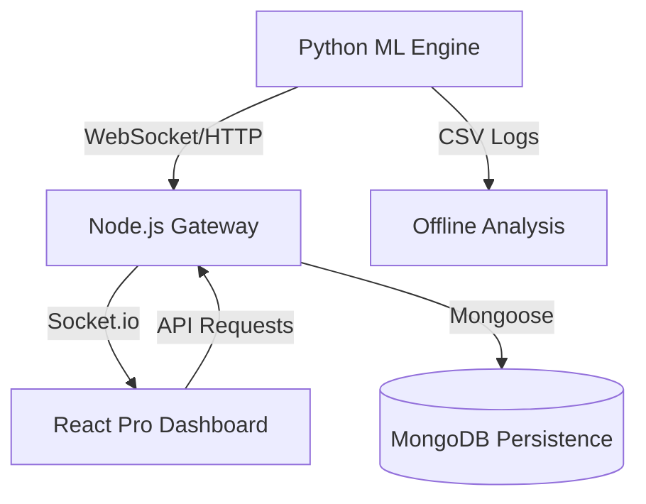

# NifnityX: Institutional-Grade Algorithmic Trading Ecosystem 🚀

### *The High-Performance Bridge Between Quantitative Intelligence and Market Execution.*

[](https://github.com/meetmehta136/2526_sdp8_NifnityX)
[](https://github.com/meetmehta136/2526_sdp8_NifnityX)
[](https://github.com/meetmehta136/2526_sdp8_NifnityX)

---

## 📌 Executive Summary

**NifnityX** (Project 2526_SDP8) is a comprehensive, sophisticated algorithmic trading decision and support platform tailored for the **Nifty 50** market. It integrates high-frequency signal generation, multi-strategy machine learning orchestration, and institutional-grade quant analytics into a single, unified experience.

Developed by **Meet Mehta** and **Dhruval Patel**, NifnityX is engineered to bridge the gap between complex ML model outputs and disciplined human-in-the-loop trade execution.

---

## ✨ System Architecture & Key Modules

### 🧪 1. The Quant Analytics Engine
NifnityX does not just track P&L; it evaluates **Risk-Adjusted Performance** using industry-standard quantitative metrics:
- **Volatility Analysis**: Real-time tracking of **Sharpe Ratio** (excess return per unit of risk) and **Sortino Ratio** (focusing on downside risk).
- **Capital Preservation**: Adaptive **Max Drawdown Analysis** with waterfall visualizations to monitor peak-to-trough degradation.
- **Equity Projection**: High-fidelity AreaCharts visualizing cumulative account growth with premium emerald-indigo gradients.
- **ML Efficacy Monitoring**: Scatter-plot analysis correlating **Model Confidence Scores** with actual **Realized P&L** to detect alpha decay.

### 📡 2. Signal Intelligence & WebSocket Sync
Designed for the "Live" feel of professional trading floors:
- **Zero-Latency State Sync**: Persistent WebSocket connection pushes `stats_update` events across the UI the millisecond a trade closes.
- **3-Layer Signal Evaluation**: Every entry is vetted through a composite score of **Technical Momentum**, **Sentiment Analysis**, and **Deep Learning Predictions**.
- **Human-in-the-Loop Approval**: A 15-second "Hot Approval" mechanism balances automation with professional oversight.

### ⚙️ 3. Hot-Swap Multi-Strategy Orchestrator
- **Sniper Adaptive**: Ultra-precision, low-frequency setups.
- **Aggressive Capture**: High-frequency momentum scaling.
- **Conservative Guard**: Capital protection focus with high-conf filters.
- **Settings HUD**: Runtime adjustment of risk-per-trade, capital allocation, and engine frequency without system downtime.

### 🎨 4. Premium "Fintech-First" Design
- **Glassmorphism UI**: High-fidelity, semi-transparent layouts with sophisticated glow effects and backdrop blurs.
- **Cubic-Ease Animations**: Professional count-up number animations and staggered component entrance for a premium, alive experience.
- **JetBrains Mono Typography**: Engineered for legibility and data-dense environments.

---

## 🛠️ Technical Stack



| Component | Technology |
|---|---|
| **Frontend** | React 19 (Vite), Tailwind CSS v4, Recharts, TradingView SDK |
| **Backend** | Node.js (Express), MongoDB, Socket.io |
| **Quant Engine** | Python 3.x, Flask, ML Signal Scoring |
| **Data Feed** | Real-time Nifty 50 OHLCV Simulation (1m interval) |

---

## 🚀 Deployment & Initialization

### 1. Environment Synthesis
Configure the core orchestrator in `NIFNITYX/nifnityx_webapp/backend/.env`:
```env
MONGO_URI=your_secure_mongo_string
PYTHON_EXECUTION_URL=http://localhost:8000
PYTHON_SECRET=nifnityx-python-key
```

### 2. High-Speed Launch Sequence
- **Core API**: `cd backend && npm install && npm run dev`
- **Analytics UI**: `cd frontend && npm install && npm run dev`
- **ML Simulation**: `python demo_simulation.py --data data/NIFTY_1MIN_2025.csv`

---

## 👥 Engineering Team

| Contributor | Core Domains |
|---|---|
| **Meet Mehta** | **Quant Systems**: NLP Research, Analytics Engine Logic, Strategy Formulation, Backend Scaling. |
| **Dhruval Patel** | **Experience Design**: Frontend Architecture, Real-time Sync Hub, Data Visualization, UI/UX Orchestration. |

---

## 📄 Compliance & License
This project is an academic submission for the **Software Development Project (SDP)**. All intellectual property relating to the specific signal generation logic and analytical engine remains with the authors.

---
> **NifnityX** — *Precision Execution. Institutional Intelligence.*
