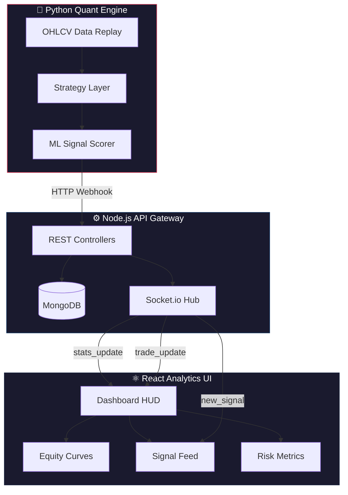

<div align="center">

# 🏛️ NifnityX

### **Institutional-Grade Algorithmic Trading Intelligence**

*The High-Performance Bridge Between Quantitative Models and Market Execution*

<br/>

[](https://react.dev)
[](https://nodejs.org)
[](https://python.org)
[](https://mongodb.com)
[](https://socket.io)
[](https://tailwindcss.com)

<br/>


---

**`Project Code`** 2526_SDP8 &nbsp;•&nbsp; **`Team`** Meet Mehta · Dhruval Patel

</div>

<br/>

## 🎯 What is NifnityX?

> **NifnityX** is a full-stack algorithmic trading ecosystem that combines **ML-powered signal generation**, **real-time WebSocket execution**, and **institutional quant analytics** into one seamless platform — purpose-built for the Indian **Nifty 50** market.

Unlike basic dashboards that only display data, NifnityX **thinks**, **scores**, **executes**, and **evaluates** — providing a closed-loop trading intelligence system.

<br/>

<div align="center">

```
┌─────────────────────────────────────────────────────────────────┐
│                    NifnityX Data Pipeline                       │
│                                                                 │
│   📊 Market Data ──► 🧠 ML Scoring ──► ⚡ Signal Generation    │
│         │                                      │                │
│         ▼                                      ▼                │
│   📈 Live Charts        15s Hot Approval ◄── 📡 WebSocket      │
│                                │                                │
│                                ▼                                │
│                     ✅ Trade Execution                          │
│                          │                                      │
│                          ▼                                      │
│              📊 Quant Analytics Engine                          │
│         Sharpe · Sortino · Drawdown · Equity                    │
└─────────────────────────────────────────────────────────────────┘
```

</div>

<br/>

---

## 🏗️ System Architecture



<br/>

---

## ✨ Feature Deep-Dive

<details>
<summary><h3>📊 &nbsp; Advanced Quant Analytics Engine &nbsp; <sup><em>click to expand</em></sup></h3></summary>

<br/>

NifnityX evaluates performance using the same metrics as hedge funds and proprietary trading desks:

| Metric | Formula | What It Measures |
|---|---|---|
| **Sharpe Ratio** | `(Rp - Rf) / σp` | Excess return per unit of total risk |
| **Sortino Ratio** | `(Rp - Rf) / σd` | Return per unit of **downside** risk only |
| **Max Drawdown** | `max(peak - trough) / peak` | Worst capital degradation from peak |
| **Win/Loss Streak** | Consecutive tracking | Strategy stability over time |
| **ML Accuracy** | `correct_predictions / total` | Model confidence vs realized outcome |

**Visualizations include:**
- 📉 **Drawdown Waterfall Chart** — Peak-to-trough capital erosion timeline
- 📈 **Equity Curve** — Animated AreaChart with emerald-indigo gradient fill
- 📊 **P&L Distribution** — Daily returns histogram with standard deviation bands
- 🎯 **ML Scatter Plot** — Confidence score vs actual P&L correlation

</details>

<details>
<summary><h3>📡 &nbsp; Real-Time WebSocket Intelligence &nbsp; <sup><em>click to expand</em></sup></h3></summary>

<br/>

NifnityX achieves **zero-latency UI updates** through a persistent Socket.io connection:

```
Backend Trade Close ──► Socket.io "stats_update" ──► Dashboard KPIs refresh
                   ──► Socket.io "new_signal"    ──► Signal Feed card appears
                   ──► Socket.io "trade_update"  ──► Trade status transitions
```

**No polling. No page refreshes.** The dashboard is always live.

- ⚡ **Instant P&L Counter**: Cubic-ease-out animated numbers that "pop" on every trade close
- 🕐 **Live IST Clock**: Real-time Indian Standard Time in the header HUD
- 🟢 **Engine Heartbeat**: Visual indicator showing Python engine connection status

</details>

<details>
<summary><h3>🧠 &nbsp; 3-Layer Signal Evaluation &nbsp; <sup><em>click to expand</em></sup></h3></summary>

<br/>

Every signal passes through a triple-filter before reaching the trader:

```
Layer 1: Technical Analysis    ──► RSI, MACD, Moving Averages
Layer 2: Sentiment Analysis    ──► NLP-based market sentiment scoring
Layer 3: ML Prediction Model   ──► Deep learning confidence score
                                        │
                                        ▼
                               Composite Score (0-100)
                                        │
                              ┌─────────┼─────────┐
                              │         │         │
                           Score<40  40-70    Score>70
                            REJECT   REVIEW   AUTO-EXEC
```

</details>

<details>
<summary><h3>🔁 &nbsp; Multi-Strategy Hot-Swap Engine &nbsp; <sup><em>click to expand</em></sup></h3></summary>

<br/>

Four battle-tested strategies, swappable at runtime with **zero downtime**:

| Strategy | Risk Profile | Signal Freq | Best For |
|---|---|---|---|
| 🎯 **Sniper** | Ultra-Low | ~1 per 5min | Precision scalping, tight stops |
| ⚖️ **Balanced** | Moderate | ~1 per 2min | Consistent daily returns |
| 🔥 **Aggressive** | High | ~1 per 30s | Momentum capture, volatile sessions |
| 🛡️ **Conservative** | Minimal | ~1 per 10min | Capital preservation mode |

**Runtime Tuning via Settings:**
- 💰 Capital Allocation (₹50K – ₹50L)
- 📊 Risk Per Trade (0.5% – 5%)
- ⏱️ Signal Frequency Multiplier

</details>

<details>
<summary><h3>🎨 &nbsp; Premium Fintech UI/UX &nbsp; <sup><em>click to expand</em></sup></h3></summary>

<br/>

Designed to match the aesthetic standards of Bloomberg Terminal and Zerodha Kite:

- 🌑 **Dark Mode First** — Engineered for extended trading sessions
- 🔮 **Glassmorphism** — Semi-transparent cards with backdrop blur and glow effects
- ✨ **Micro-Animations** — Staggered entrance, shimmer loading states, pulsing indicators
- 🔤 **Pro Typography** — Inter (UI) + JetBrains Mono (data) for maximum readability
- 🖥️ **Split-Screen Auth** — Professional login with animated background orbs

</details>

<br/>

---

## 🛠️ Tech Stack

<div align="center">

| Layer | Technologies | Purpose |
|:---:|---|---|
| **Frontend** | React 19 · Vite · Tailwind v4 · Recharts · TradingView | Analytics visualization & trading interface |
| **Backend** | Node.js · Express · Socket.io · Mongoose | REST API, auth, real-time broadcasting |
| **Database** | MongoDB (Atlas / Local) | Trade persistence, user management |
| **Engine** | Python 3.x · Flask · NumPy | Signal generation, ML scoring, backtesting |
| **DevOps** | Git · GitHub · Nodemon | Version control, CI workflow |

</div>

<br/>

---

## 🚀 Quick Start

```bash
# 1. Clone
git clone https://github.com/meetmehta136/2526_sdp8_NifnityX.git
cd 2526_sdp8_NifnityX/NIFNITYX

# 2. Backend
cd nifnityx_webapp/backend
npm install
# Configure .env with MONGO_URI, PYTHON_EXECUTION_URL, PYTHON_SECRET
npm run dev

# 3. Frontend (new terminal)
cd nifnityx_webapp/frontend
npm install
npm run dev

# 4. Python Engine (new terminal)
pip install -r requirements.txt
python demo_simulation.py
```

<details>
<summary><strong>📋 Environment Variables Reference</strong></summary>

```env
# backend/.env
MONGO_URI=mongodb+srv://your_connection_string
PORT=5000
PYTHON_EXECUTION_URL=http://localhost:8000
PYTHON_SECRET=nifnityx-python-key
JWT_SECRET=your_jwt_secret
```

</details>

<br/>

---

## 📁 Project Structure

```
NIFNITYX/
├── nifnityx_webapp/
│   ├── backend/
│   │   ├── controllers/          # Trade logic, analytics (Sharpe/Sortino), auth
│   │   ├── routes/               # RESTful API endpoints
│   │   ├── models/               # MongoDB schemas (User, Trade)
│   │   └── index.js              # Express + Socket.io initialization
│   │
│   └── frontend/
│       ├── src/
│       │   ├── pages/            # Dashboard, Analytics, Signals, Settings, Login
│       │   ├── components/       # Glassmorphism cards, HUD, charts
│       │   ├── contexts/         # TradeContext (global WebSocket state)
│       │   └── lib/              # Socket.io client, API helpers
│       └── index.css             # Premium design tokens & animations
│
├── demo_simulation.py            # High-speed demo signal generator
├── simulation_paper_trading.py   # Production paper trading engine
├── data/
│   └── NIFTY_1MIN_2025.csv      # 1-minute OHLCV (full 2025 dataset)
└── simulation_logs/              # Auto-generated CSV trade reports
```

<br/>

---

## 👥 Engineering Team

<div align="center">

|  |  |
|:---:|:---:|
| **Meet Mehta** | **Dhruval Patel** |
| Quant Engine · ML/NLP · Strategy Logic | Frontend Architecture · WebSocket · UI/UX |
| [](https://github.com/meetmehta136) | [](https://github.com/dhruvalpatel-dev) |

</div>

<br/>

---

## 🗓️ Development Timeline

| Phase | Focus | Key Deliverables |
|---|---|---|
| **Phase 1** | Foundation | Dashboard layout, TradingView integration, Python engine |
| **Phase 2** | Intelligence | Signal scoring, human-in-the-loop approval, WebSocket sync |
| **Phase 3** | Analytics | Sharpe/Sortino ratios, drawdown analysis, equity curves |
| **Phase 4** | Polish | Glassmorphism UI, micro-animations, Settings page, demo engine |

<br/>

---

<div align="center">

### 📄 License

This project was developed as part of an academic **Software Development Project (SDP)**.
All intellectual property rights remain with the contributors.

<br/>

---

<br/>


<sub>Built with ❤️ by Meet Mehta & Dhruval Patel · 2025–2026</sub>

</div>
